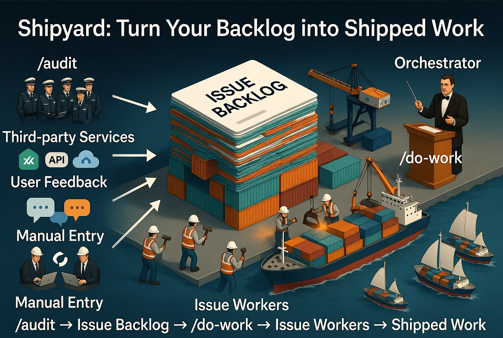

<p align="center">
  
</p>

> ## 🚨 Experimental — read before you run this against anything important 🚨
>
> The shipyard plugin runs an **autonomous code-modification loop** — it
> edits files, pushes branches, opens PRs, and arms auto-merge on PRs once their CI goes green. Before
> using it on a repo you care about:
>
> - **Treat it as experimental.** Behavioral bugs around termination, dispatch fairness, and worker
>   isolation are still being shaken out. Behavior will change between commits.
> - **Treat it as potentially unsafe.** Safety is enforced primarily through prompt discipline rather
>   than architectural sandboxing. The tool has broad permissions by design — file system, `git`, `gh`,
>   hook execution.
> - **Treat it as expensive.** Parallel `/do-work` workers each pay full per-context costs; recursive
>   audit / refine flows can dispatch deep agent trees. Start with `--concurrency 1` and watch the
>   billing dashboard before scaling.
> - **Limited automated testing.** Bash unit tests cover the supporting scripts and hooks
>   (run by `.github/workflows/tests.yml`), but the skills, commands, and agents themselves are markdown
>   specs without automated behavior verification — that side is manual + dogfooding.
> - **No API stability.** Slash-command shape, skill interfaces, and agent contracts evolve fast.
>   Pin to a specific commit if you need reproducibility; expect drift between updates.
> - **No support.** No SLA, no incident response, issues triaged at the author's discretion.
>
> Recommended posture for first-time use: a throwaway repo, `--concurrency 1`, default-deny Claude
> Code permissions, and a billing alert on your Anthropic account.

# Shipyard

An experimental [Claude Code](https://docs.claude.com/en/docs/claude-code) plugin — an autonomous engineering loop that finds work via audits, refines raw user feedback into actionable tickets, and burns down the backlog with a rolling pool of parallel workers in isolated git worktrees.

<p align="center">
  
</p>

*Shipyard at a glance — five stages of the autonomous engineering loop. Read the [How it works](#how-it-works) section below for details.*

## Quick start

Get from zero to your first auto-merging PR in about five minutes.

### Prerequisites

- [Claude Code](https://docs.claude.com/en/docs/claude-code) installed and signed in.
- The [GitHub CLI](https://cli.github.com/) (`gh`) installed and authenticated (`gh auth login`). Shipyard drives every GitHub interaction through `gh`.
- A local checkout of a GitHub repo with at least one open issue. Branch protection / required CI checks are fine — shipyard arms auto-merge and lets the merge train do the rest.

### 1. Install the plugin

```sh
claude plugin marketplace add mattsears18/shipyard
claude plugin install shipyard@shipyard
```

Then run `/reload-plugins` so the new slash commands register.

### 2. Run your first command

From inside any GitHub-connected repo, try one of these:

```sh
# Burn down the backlog — pick up open issues and ship PRs in parallel.
/do-work --concurrency 4

# Find work — audit a live URL for performance, SEO, a11y, and best-practices,
# and autonomously file an issue per finding.
/audit lighthouse https://your-app.example.com

# Refine issues that aren't ready for /do-work yet (source-branched):
# user-feedback classify+rewrite, open-questions resolve-defaults, or
# escalate-to-triage fall-through.
/refine-issues

# Auto-decompose confirmed epics (needs-human-review + the
# <!-- do-work-needs-decomposition --> body marker) into dispatch-ready
# sub-issues so the sub-work re-enters /do-work without a human round-trip.
/decompose-epic

# See what's blocked on YOU (PRs waiting on review, issues needing triage, etc.)
# — the human-facing counterpart to /do-work.
/my-turn

# Walk a decision-gated issue's blocking decisions one-by-one (with a
# recommendation for each), record the answers, and clear the gate so
# /do-work can pick it up — the mutating sibling of /my-turn.
/resolve-decisions --issue 1816
```

### 3. Watch the loop

When you run `/do-work`, you'll see:

- A markdown table of the ranked backlog at start (and again at end of session).
- A one-line status header printed before the initial pool fill (and re-printed whenever repo-health state changes — main going red, a divert firing, the failing-PR count crossing the threshold).
- `--concurrency N` parallel workers, each in its own isolated git worktree under `.claude/worktrees/`, opening PRs that close their assigned issues. Each PR has auto-merge with squash armed — green CI means it merges itself.

When `/audit` runs, you'll see filed issues with severity labels (`P0`/`P1`/`P2`) and an audit-key HTML comment for dedup.

### Next steps

- Read [How it works](#how-it-works) for the full four-phase loop (inputs → refine → human review → orchestrator → workers → PR).
- Skim [What's been hardened](#whats-been-hardened) for the safety properties that keep autonomous runs from clobbering your repo.
- Wire up a Sentry / Datadog / Dependabot integration that files GitHub issues — see [Plays well with everything that files GitHub issues](#plays-well-with-everything-that-files-github-issues).

## Updating

Shipyard is moving fast — expect frequent releases. The one-keystroke path:

```sh
/shipyard:update
```

That runs the marketplace refresh and the plugin update in order, then prompts you to run `/reload-plugins` so the refreshed slash commands, agents, and hooks register. (A slash command can't reload the plugin it's a member of — that's why `/reload-plugins` is a separate step.)

See [`CHANGELOG.md`](./CHANGELOG.md) for what's in each release. Pin to a specific commit if you need reproducibility — the experimental-status warning at the top of this README applies, and slash-command shape, skill interfaces, and agent contracts evolve between updates.

## What it does

An autonomous engineering loop for web + mobile app development. Three things it does:

1. **Finds work** — `/audit` runs deep audits across UX, performance, security, accessibility, DX, privacy, PWA readiness, release readiness, SEO, tech debt, testing, docs, observability, and API surface health, and autonomously files GitHub issues for every finding.
2. **Refines work** — `/refine-issues` is a source-branched refiner: raw user-feedback issues get classified (already-done / decline / legitimate) and rewritten into implementation-ready tickets; Claude-filed feature requests with `## Open questions` get reasonable defaults committed; everything else falls through to `needs-triage`. The user-feedback path is gated by a `needs-human-review` label so no code-modifying agent runs until a human signs off; the open-questions and triage paths are decoupled from human review.
3. **Does work** — `/do-work` orchestrates a rolling pool of parallel issue-workers, each in an isolated git worktree. It dispatches up to `--concurrency` workers at once, opens PRs with auto-merge, and gracefully handles failing checks, red main CI, and PR pileups via specialized diversion workers.

**Slash commands:**

- `/audit lighthouse <url>` — perf / SEO / best-practices / agentic browsing via Lighthouse
- `/audit web-ux <url>` — live tour via Chrome DevTools MCP
- `/audit mobile-ux` — review of stored screenshots (`store-assets/screenshots/{ios,android}/*`)
- `/audit ux <url>` — web-ux + mobile-ux in parallel
- `/audit security <url>` — deps, secrets in git, Firebase rules, headers, mobile manifests
- `/audit a11y <url>` — Lighthouse a11y category + manual keyboard / screen-reader tour
- `/audit seo <url>` — sitemap, structured data, OG/Twitter cards, canonical URLs, image alt text, internal link graph
- `/audit privacy <url>` — GDPR / CCPA / COPPA: cookie banners, ATT prompts, account-deletion flow, ASC + Play privacy forms
- `/audit pwa <url>` — manifest completeness, service worker behavior, offline fallback, install prompt UX, icon coverage
- `/audit release-readiness` — CHANGELOG ↔ store-metadata sync, app-icon coverage, splash screens, deep-link asset files, version bumps
- `/audit dx` — developer-experience catalog (lints, hooks, observability, contributor docs, etc.)
- `/audit tech-debt` — stale TODO/FIXME markers, dead feature flags, deprecated internal APIs still in use, outdated deps
- `/audit testing` — coverage holes on critical paths, empty / tautological / mock-only tests, CI gate completeness
- `/audit docs` — README drift, broken links, docstring drift from signatures, missing ADRs, stale dated TODOs in docs
- `/audit observability` — error-tracking effectiveness, structured-logging consistency, tracing coverage, alert config
- `/audit api` — OpenAPI / GraphQL schema drift, missing pagination, inconsistent auth and error envelopes, breaking-change diffs
- `/audit all <url>` — every audit in parallel
- `/refine-issues` — process refinement-gated issues (user-feedback classify+rewrite, open-questions resolve-defaults, or escalate-to-triage fall-through).
- `/decompose-epic` — auto-decompose confirmed epics (issues carrying `needs-human-review` + the `<!-- do-work-needs-decomposition -->` body marker) into dispatch-ready GitHub sub-issues. `Multi-PR sequence:` / `Missing dependency:` evidence classes get sharded into an ordered `Blocked by #<sibling>` chain (so `/do-work` sequences them automatically); non-mechanical classes fall through to the existing human handoff. Explicit, human-invoked — mirrors `/refine-issues`' sentinel-keyed shape.
- `/do-work` — burn down the issue backlog with a rolling pool of parallel workers (default `--concurrency 2`)
- `/my-turn` — surveys open PRs, the issue backlog, and recent comments to produce a prioritized list of items currently blocked on **you** (not on Claude). Read-only — pairs with `/do-work` as the human-driven counterpart. When the top item is decision-gated, it *offers* (read-only) to hand off to `/resolve-decisions`.
- `/resolve-decisions` — interactively walk a decision-gated `needs-human-review` issue's blocking decisions one at a time (each with context, options, and a concrete recommendation+reasoning), then record the answers as a structured issue comment and remove the gating label so `/do-work` can pick it up. The mutating sibling of the read-only `/my-turn`.
- `/shipyard:init` — scaffold a `shipyard.config.json` with layered overrides for concurrency, label namespaces, and per-mode caps. See [`CLAUDE.md`'s "Configuration" section](./CLAUDE.md#configuration-shipyardconfigjson--layered-overrides) for the layering model.
- `/shipyard:config show|get|set|edit|validate` — inspect or update the effective merged config across the four layers (built-in defaults, user-global, repo, personal override).
- `/shipyard:cost report` — query the persistent cost-history ledger at `~/.shipyard/cost-history.jsonl`; filter by repo, mode, model, or issue. See [`CLAUDE.md`'s "Cost-tracking ledger" section](./CLAUDE.md#cost-tracking-ledger-shipyardcost-historyjsonl).
- `/shipyard:status` — live dashboard of in-flight `/shipyard:do-work` workers (mode, target, elapsed, tokens, stale detection).
- `/shipyard:update` — one-keystroke shipyard update; prompts you to run `/reload-plugins` once the refresh lands. See the [Updating section](#updating) above.
- `/shipyard:file-issue <description>` — discoverable one-keystroke entry point for filing a well-formed issue against the current repo. Loads the [`filing-github-issues`](plugins/shipyard/skills/filing-github-issues/SKILL.md) skill (Conventional Commits title, label discovery, duplicate search, body template) and the [`audit-rubrics`](plugins/shipyard/skills/audit-rubrics/SKILL.md) severity rules (P0/P1/P2), drafts the issue, files via `gh issue create`, returns the URL. For the human-in-the-loop case — auditors and `/do-work` workers file via the skill directly.

Each audit runs in an isolated subagent, files its own issues using the shared `filing-github-issues` skill (Conventional Commits titles, label discovery, duplicate search), and respects the severity rules in `audit-rubrics` (P0–P2). Fully autonomous — no per-step approval gates.

## How it works

The loop has four phases, and the orchestrator drives them on every iteration of `/do-work`:

1. **Inputs.** Issues arrive from multiple sources, all unified at the GitHub-issue layer. The `/audit` family files them autonomously — a Lighthouse pass on a live URL, a Chrome DevTools tour, a security sweep, an a11y audit, etc. — each finding becomes a labeled GitHub issue with severity (`P0`/`P1`/`P2`). Your app's feedback form posts raw user reports via a backend proxy that opens issues carrying `user-feedback`. Humans file issues through the [GitHub issue template chooser](.github/ISSUE_TEMPLATE/) (`bug_report`, `feature_request`, `user_feedback`). There's no intake-time gate label — refinement candidates are detected just-in-time by `/refine-issues`' source-signal scan (external authors, bodies with unresolved `## Open questions`, bare one-liners, and bot-authored issues) as a pre-dispatch pass; the separate `external-author-gate.yml` still gates stranger-authored issues with `needs-human-review` at intake.

2. **Refine.** `/refine-issues` scans every open issue for a refinement source signal — no persisted `needs-refinement` label (eliminated in [#520](https://github.com/mattsears18/shipyard/issues/520); candidacy is recomputed live) — and branches by signal: raw user-feedback issues get classified (`already-done` / `decline` / `legitimate`), preserved, and rewritten into engineering tickets with `needs-human-review` set; Claude-filed feature requests with open questions get reasonable defaults committed and become dispatch-eligible immediately; everything else with no automated path falls through to `needs-human-review` for human review. The resolve-defaults branch does NOT apply `needs-human-review` — only the user-feedback and fall-through branches do. No code-modifying agent will touch user-feedback issues until `needs-human-review` is removed.

3. **Human review.** You scan the refined backlog, drop `needs-human-review` from the ones you want shipped, and run `/do-work`. This is the only required human step. Everything before it (audits filing, feedback refining) and everything after (dispatch, fix-up, merge) is autonomous. Use [`/my-turn`](plugins/shipyard/commands/my-turn.md) for a focused read-only view of what's actually blocked on you across PRs and issues.

4. **Orchestrator → workers → PR.** `/do-work` ranks the eligible backlog, then keeps `--concurrency` workers in flight at all times. Each worker is dispatched into an isolated git worktree on a deterministic branch (`do-work/issue-<N>`), implements the smallest change that satisfies the acceptance criteria, opens a PR that closes the issue, and enables auto-merge with squash. Green CI = merged = the next worker slot opens. When CI goes red, an in-progress PR fails its checks, or the default branch breaks, the orchestrator diverts a worker to fix it before resuming normal backlog work.

The result: you write issues (or let `/audit` write them), you sign off on the user-feedback ones, and the rest of the chain runs without you.

### Label conventions

Shipyard treats several label families as load-bearing — origin labels (`user-feedback`, `audit:<dimension>`), the session-stamp label (`shipyard`), state labels in the `blocked:*` namespace (`blocked:agent`, `blocked:ci`), and gate labels (`needs-human-review`, `needs-triage`). The canonical reference lives in [`CLAUDE.md`'s "Label conventions" section](./CLAUDE.md#label-conventions) — that's the source of truth; this README intentionally doesn't duplicate it.

### Observability — per-session token cost

Every `/do-work` session writes per-session token-usage data to `~/.shipyard/sessions/<session-id>.json` and posts cost-tracking comments on the issues and PRs it touches, so you can see at a glance how much a given backlog burndown cost. End-of-session, each run flushes a rolled-up record to the persistent ledger at `~/.shipyard/cost-history.jsonl`; query historical spend with `/shipyard:cost report` (filterable by repo, mode, model, or issue — see [`CLAUDE.md`'s "Cost-tracking ledger" section](./CLAUDE.md#cost-tracking-ledger-shipyardcost-historyjsonl)). Useful for tuning `--concurrency`, deciding which audits are worth running on a cron, and spotting agents that are spending too many tokens for the work they ship.

### CI-minute discipline (`ci.*` config block — issue [#323](https://github.com/mattsears18/shipyard/issues/323))

`/do-work` can rack up GitHub Actions minutes on repos with expensive CI suites (E2E shards, Lighthouse, accessibility audits) when it speculatively retriggers full CI suites — failing-PR re-dispatches against stale failures, drain-phase fix-rebase force-pushes on every DIRTY PR, etc. The `ci.*` block in `shipyard.config.json` provides five operator-tunable knobs that cap the spend; all default to pre-#323 behavior so adopting them is opt-in.

| Key | Default | Effect when flipped |
|---|---|---|
| `ci.skip_drain_rebase` | `false` | Drain phase skips ALL fix-rebase dispatch. DIRTY PRs surface as "needs manual rebase" in the summary instead of consuming one full CI suite per force-push. |
| `ci.max_drain_rebases` | `null` | Soft cap on drain-phase fix-rebase dispatches per session. Dispatches the top-N (lowest PR number first) and surfaces the rest. |
| `ci.verify_check_failing_on_head_before_dispatch` | `false` | Before fix-checks dispatch, verify the failing check's run-SHA matches the PR's current `headRefOid`. Drop the dispatch if stale (failure already pushed past). |
| `ci.require_in_progress_check_to_settle` | `false` | If a `failed_prs` candidate has any check still IN_PROGRESS on the current head, defer dispatch until the run settles. Prevents the double-push case. |
| `ci.skip_speculative_rerun` | `true` | Codifies the absence of `gh run rerun` calls. Default-true (the orchestrator doesn't issue reruns anywhere in the current spec); flipping it allows a future change to enable speculative reruns. |

End-of-session summary surfaces a `CI cost (#323):` block whenever any `ci.*` key is non-default OR any counter is non-zero, with a per-key breakdown and an `Estimated CI suites avoided this session: N` total. Detailed rationale and a worked example live in [`do-work-RATIONALE.md → CI-minute discipline`](./plugins/shipyard/commands/do-work-RATIONALE.md#ci-minute-discipline-issue-323).

## What's been hardened

A non-exhaustive list of safety properties the orchestrator and workers carry today. Each bullet links to the PR or issue where the property landed:

- The orchestrator never goes idle while workable backlog or open `@me` PRs remain — a structured invariant line prints every turn so going-quiet-with-work-left is detectable ([#23](https://github.com/mattsears18/shipyard/issues/23)).
- User feedback enters via a backend-mediated intake and is refined + human-gated before any code-modifying agent runs against it ([#24](https://github.com/mattsears18/shipyard/issues/24)).
- Workers are forbidden from `git commit --no-verify` and equivalent hook bypasses, enforced both at the prompt and at the `Bash` permission layer in `plugin.json` ([#26](https://github.com/mattsears18/shipyard/issues/26)).
- The orchestrator re-checks the backlog before every dispatch — issues filed mid-session don't have to wait for a periodic refresh to be picked up ([#29](https://github.com/mattsears18/shipyard/issues/29)).
- Issue-worker dispatches are pinned to `isolation: "worktree"` via a `PreToolUse` hook. Workers operate in a dedicated worktree and never touch the user's primary checkout's HEAD ([#34](https://github.com/mattsears18/shipyard/issues/34)).

## See it in action

**Shipyard is built with shipyard.** The majority of merged PRs in this repo were opened by `/do-work` workers — each one opened, fixed-up through CI failures (if any), and merged without a human touching the keyboard between issue triage and PR review. The `shipyard` label stamps every PR the orchestrator produces. Browse the living demo:

- [**Issues →**](https://github.com/mattsears18/shipyard/issues?q=is%3Aissue) — the backlog the orchestrator has been working, plus the closed ones with their resolving PRs linked
- [**`shipyard`-labeled closed PRs →**](https://github.com/mattsears18/shipyard/pulls?q=is%3Apr+is%3Aclosed+label%3Ashipyard) — the merged outputs

## Plays well with everything that files GitHub issues

Shipyard doesn't care **where** an issue came from — it only cares that the issue exists, is open, and isn't already assigned to someone else. That makes it compose with any service that can file GitHub issues:

- **Sentry** → auto-files issues for new production exceptions. Shipyard reproduces the bug, ships a fix, closes the Sentry issue.
- **Datadog / New Relic / Honeycomb** → file issues for SLO breaches and anomalies. Shipyard investigates and fixes the underlying cause.
- **Dependabot / Renovate** → file PRs for outdated/vulnerable dependencies. Shipyard picks up the open issues those tools file and resolves them.
- **GitHub Advanced Security / CodeQL** → file issues for code-scanning findings. Shipyard fixes the vulnerability or files a justified suppression.
- **Customer support tools (Zendesk, Intercom)** → many have GitHub integrations that file issues from support tickets. Shipyard treats those just like user feedback (filed with the `user-feedback` label → refined → human-reviewed → worked; see [Refines work](#what-it-does) above and the `/refine-issues` flow — the user-feedback classify+rewrite branch).
- **Your own infrastructure** — anything you wire up via the GitHub API to file issues.

The pattern: every "thing that's broken" becomes a GitHub issue, shipyard works the issue, the fix ships. The app becomes **effectively self-healing** — production errors don't sit until a human notices; they sit until shipyard's next dispatch.

### Concrete example: Sentry round-trip

1. A user hits a `NullPointerException` in your app. Sentry catches it.
2. Sentry's GitHub integration files a new issue: "NullPointerException in `OrderService.calculateDiscount`" with stack trace + frequency + affected user count.
3. Shipyard's `/do-work` is running (locally, in CI on a cron, or invoked manually). On its next backlog refresh, it picks up the new issue.
4. The dispatched worker reproduces the failure (per the mandatory-repro rule), writes a failing test, fixes the null check, commits, opens a PR with `Closes #N`, enables auto-merge.
5. CI runs green. PR auto-merges. Sentry's issue closes automatically (via the `Closes #N` line). The fix is deployed on your next release.

Total human intervention: **zero**, modulo whatever review process you keep at the PR level (branch protection, required reviewers, etc.).

The Sentry flow above is illustrative, not a case study — your mileage depends on the quality of the upstream issue and the kind of bug. See the caveats below.

### Caveats

- **Quality of the upstream issue matters.** A clean Sentry stack trace is great; a one-line "something broke" issue is not. The better the auto-filer's report, the better the fix.
- **User-feedback flows through refinement first.** Customer-support tools that file raw user complaints should label issues with `user-feedback` + `needs-human-review` (the `user-feedback` label is itself the source signal `/refine-issues` scans for) so `/refine-issues`' classify+rewrite branch cleans them up and a human signs off before shipyard touches them.
- **Not everything is auto-fixable.** Shipyard returns `blocked` on issues it can't repro or for which it can't infer a fix. Those still need humans — but they were going to need humans anyway. The win is on the long tail of "easy fixes that just sat there."
- **Set sane labels at the auto-filer.** Most integrations let you specify labels at the issue-creation API call. Apply a priority label (`P0`/`P1`/`P2`) so the orchestrator ranks them correctly.

## Layout

```
.claude-plugin/marketplace.json
.github/
  CODEOWNERS                     # maintainer-review gate (e.g. .shipyard/trusted-authors.txt)
  ISSUE_TEMPLATE/                # bug_report, feature_request, user_feedback templates
  PULL_REQUEST_TEMPLATE.md       # shown to anyone opening a PR
  workflows/
    label-event-audit.yml        # alerts / reverts unauthorized label changes
    external-author-gate.yml     # gates PRs from external authors
    secret-scan.yml              # blocks committed secrets
    shellcheck.yml               # lint for bash scripts
    tests.yml                    # bash unit tests
plugins/
  shipyard/
    .claude-plugin/plugin.json
    commands/
      audit.md
      config.md
      cost.md
      decompose-epic.md
      do-work.md
      do-work/                   # per-phase phase files loaded on demand by do-work.md
      do-work-RATIONALE.md       # design discussion companion
      init.md
      my-turn.md
      refine-issues.md
      resolve-decisions.md
      status.md
    agents/
      a11y-auditor.md
      api-auditor.md
      docs-auditor.md
      dx-auditor.md
      issue-worker.md            # thin entry router; per-mode files under issue-worker/
      issue-worker/              # one file per mode (issue-work, fix-checks-only, fix-rebase, ...)
      lighthouse-auditor.md
      mobile-ux-auditor.md
      observability-auditor.md
      privacy-auditor.md
      pwa-auditor.md
      release-readiness-auditor.md
      security-auditor.md
      seo-auditor.md
      tech-debt-auditor.md
      testing-auditor.md
      web-ux-auditor.md
    skills/
      auditing-authenticated-surfaces/SKILL.md   # safe pattern for auditing login-walled surfaces
      audit-rubrics/SKILL.md
      dx-catalog/SKILL.md
      filing-github-issues/SKILL.md
      worker-preamble/SKILL.md   # shared dispatch contract for every /do-work worker
    hooks/
      hooks.json
      enforce-worktree-isolation.sh
      report-plugin-error.sh
    scripts/
      report-plugin-error.sh
      session-state.sh
      worktree-reap.sh
      tests/
CLAUDE.md                        # repo-scoped rules (load-bearing for Claude sessions)
CONTRIBUTING.md                  # navigable index of contribution conventions
LICENSE                          # MIT
CHANGELOG.md                     # per-version changelog (plugin version bumps)
```

## Optional: auto-file issues on skill/agent failure

The `shipyard` plugin can automatically file a GitHub issue against `mattsears18/shipyard` whenever one of its own skills or agents appears to have failed during your session. The point: real failures become structured bug reports without anyone having to type one up.

It is **opt-in** — nothing is filed unless you set:

```sh
export SHIPYARD_AUTOREPORT=1
```

Once enabled, hooks (`PostToolUse` on `Task|Agent` and `SubagentStop`) invoke `plugins/shipyard/scripts/report-plugin-error.sh`. That script:

1. **Detects** failure signals — `is_error: true`, `error:` / `stderr:` fields, or `blocked:` / `Error:` / `Traceback (...)` / `Fatal:` markers in the agent output. Only acts on subagents/skills whose name starts with `shipyard:`.
2. **Scrubs secrets** — GitHub PATs (`ghp_…`, `github_pat_…`), Anthropic / OpenAI keys (`sk-ant-…`, `sk-…`), Stripe keys (`sk_live_…`, `sk_test_…`), Google API keys (`AIza…`), AWS access keys (`AKIA…`), Slack tokens (`xoxb-`/`xoxp-`/…), GitLab PATs (`glpat-…`), npm tokens (`npm_…`), JWTs (three-segment base64url), SSH/RSA/EC private-key PEM blocks, database connection URLs that embed credentials (`postgres://user:pass@…`), `Authorization:` / `Bearer …` headers, email addresses, `$HOME` paths, and any 40+ char hex blob.
3. **Builds a signature** from the skill/agent name + a digit-normalized error excerpt, then **searches open `auto-reported` issues** for a match. If found → adds a comment with the new occurrence. If not → files a fresh issue with `auto-reported` and `bug` labels.
4. **Never breaks your session** — the helper traps errors and always exits 0. The hook runs the helper detached in the background so reports don't block the foreground.

### What is transmitted

Scrubbing covers **secret-shaped patterns** (the list in step 2 above) — it does not redact general prose. Each auto-report includes the following fields drawn from the live session, and any non-secret content in them is filed as-is:

- **Invocation prompt** — the agent's task description, up to 1000 chars. For a `shipyard:issue-worker` dispatch this is the full task string (e.g. `work issue 42 in <owner>/<repo>`), which may include the target repo name and issue identifiers.
- **Error details** — up to ~2000 chars of the failure output.
- **Transcript excerpt** — the last 80 lines (up to 3000 chars) of the agent's session transcript. This is the raw record of the session and can include filenames, file contents read via the `Read` tool, `gh issue view` output, git diff output, and bash command output from the working session.
- **Environment** — OS, shell, Claude Code version, model.

If the failing session was operating on a **private codebase or private issue tracker**, those excerpts may carry filenames, code snippets, or issue text from that codebase into a public GitHub issue on the target auto-report repo. The scrubber has no way to distinguish "private project context" from "debug noise" — only secret-shaped tokens are removed.

**Preview before opting in.** Use the dry-run mode (`SHIPYARD_AUTOREPORT_DRY=1`, documented below) to see exactly what *would* be filed without actually filing it. If you work with sensitive codebases, either preview reports this way before enabling live mode, or set `SHIPYARD_AUTOREPORT_REPO` to a private repo you control so the reports never become public.

### Configuration

| Env var | Default | Effect |
|---|---|---|
| `SHIPYARD_AUTOREPORT` | unset | Must be `1` to enable. |
| `SHIPYARD_AUTOREPORT_REPO` | `mattsears18/shipyard` | Target repo for auto-reports. |
| `SHIPYARD_AUTOREPORT_DRY` | unset | When `1`, the helper prints the would-be issue as JSON to stdout instead of calling `gh`. Used by the test suite and useful for local previews. |

### Issue shape

Every auto-report has these sections:

- `## What happened` — short failure summary.
- `## Skill/Agent` — name, hook event, tool.
- `## Reproduction` — invoking prompt + description (scrubbed).
- `## Error details` — first ~2000 chars of the failure output (scrubbed).
- `## Environment` — OS, shell, Claude Code version, model.
- `## Transcript excerpt` — last 80 lines of the agent transcript, scrubbed.
- `## Recommendations for improvement` — pattern-level suggestions for maintainers.
- An HTML-comment de-dup signature: `<!-- autoreport-key=<skill>::<normalized-error> -->`.

### Try it out (dry run)

```sh
echo '{"tool_name":"Agent","tool_input":{"subagent_type":"shipyard:issue-worker","prompt":"work issue 1"},"tool_response":{"is_error":true,"error":"Error: gh api 404"}}' \
  | SHIPYARD_AUTOREPORT=1 SHIPYARD_AUTOREPORT_DRY=1 \
    bash plugins/shipyard/scripts/report-plugin-error.sh
```

You'll get a JSON blob with the `title`, `body`, `labels`, `signature`, and `who` that *would* have been filed.

### Test suite

```sh
bash plugins/shipyard/scripts/tests/report-plugin-error.test.sh
```

### Follow-ups

- v1 ships with `auto-reported` and `bug` labels only. Per-skill / per-agent labels (e.g. `skill:filing-github-issues`, `agent:issue-worker`) are deferred to keep label cardinality controlled until we see what categories actually show up in practice.

## Filing issues

The repo's [issue template chooser](.github/ISSUE_TEMPLATE/) routes filers into one of three forms:

- **`bug_report`** — something is broken; includes repro steps + expected vs actual behavior.
- **`feature_request`** — propose new functionality; surfaces an `## Open questions` block that the [`/refine-issues`](plugins/shipyard/commands/refine-issues.md) `resolve-defaults` branch acts on.
- **`user_feedback`** — raw, unstructured user reports; auto-labeled `user-feedback` and routed through the classify+rewrite refiner branch with `needs-human-review` gating.

Refinement candidates are detected just-in-time by `/refine-issues`' source-signal scan rather than a persisted intake gate label (see [How it works](#how-it-works) above; the `needs-refinement` label was eliminated in [#520](https://github.com/mattsears18/shipyard/issues/520)). Anyone opening a PR will see [`.github/PULL_REQUEST_TEMPLATE.md`](.github/PULL_REQUEST_TEMPLATE.md) — fill it out so the reviewer has the context they need.

## Contributing

See [`CONTRIBUTING.md`](./CONTRIBUTING.md) for the navigable index of operational conventions — getting started, adding a new auditor, working on shipyard core, label conventions, testing, branch naming, commit message style, and the PR workflow. The full label reference and repo-scoped rules live in [`CLAUDE.md`](./CLAUDE.md); the orchestrator design rationale lives in [`plugins/shipyard/commands/do-work-RATIONALE.md`](./plugins/shipyard/commands/do-work-RATIONALE.md).

## License

[MIT](./LICENSE) — see the `LICENSE` file for the full text.

---

<sub>See [`CHANGELOG.md`](./CHANGELOG.md) for the current shipyard release.</sub>
