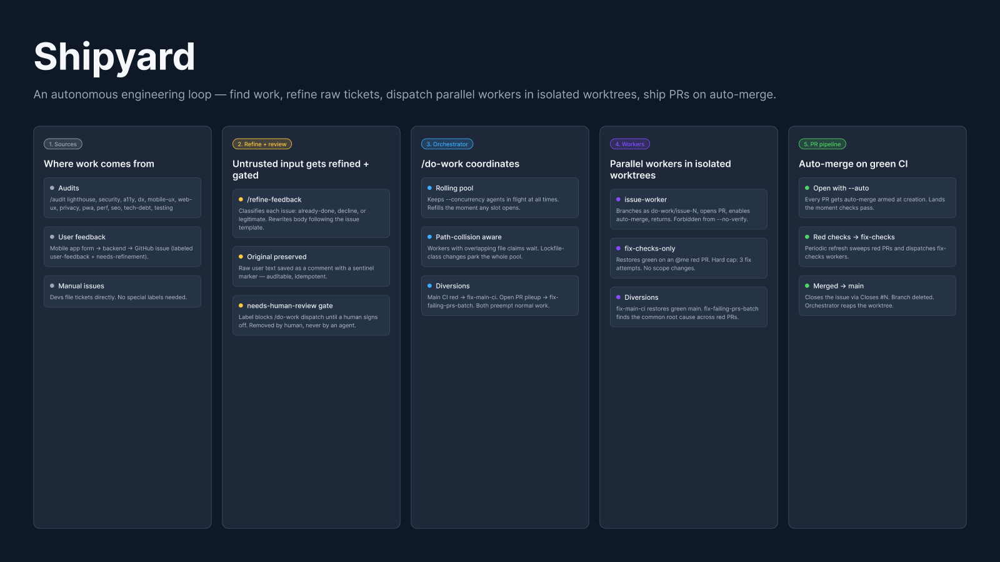

# mattsears-plugins

Personal [Claude Code](https://docs.claude.com/en/docs/claude-code) plugins by Matt Sears. The headliner is **`shipyard`** — an autonomous engineering loop that finds work via audits, refines raw user feedback into actionable tickets, and burns down the backlog with a rolling pool of parallel workers in isolated git worktrees.

<p align="center">
  
</p>

*Shipyard at a glance — five stages of the autonomous engineering loop. Read the [How shipyard works](#shipyard) section below for details.*

## Quick start

```sh
claude plugin marketplace add mattsears18/claude-plugins
claude plugin install shipyard@mattsears-plugins
```

Restart Claude Code, then from inside any GitHub-connected repo run `/do-work --concurrency 4`. You'll see the backlog ranked, a live HTML dashboard open at `/tmp/do-work-dashboard.html`, and 4 parallel workers start opening PRs against your open issues — each with auto-merge armed, so green CI = merged.

## Plugins

### `shipyard`

An autonomous engineering loop for web + mobile app development. Three things it does:

1. **Finds work** — `/audit` runs deep audits across UX, performance, security, accessibility, DX, privacy, PWA readiness, release readiness, SEO, tech debt, and testing, and autonomously files GitHub issues for every finding.
2. **Refines work** — `/refine-feedback` ingests raw user-feedback issues (filed into the repo by your app's feedback form via a backend proxy), classifies them (already-done / decline / legitimate), preserves the original text in a comment, and rewrites the body to be implementation-ready. Gated by a `needs-human-review` label so no code-modifying agent runs until a human signs off.
3. **Does work** — `/do-work` orchestrates a rolling pool of parallel issue-workers, each in an isolated git worktree. It dispatches up to `--concurrency` workers at once, opens PRs with auto-merge, and gracefully handles failing checks, red main CI, and PR pileups via specialized diversion workers.

**Slash commands:**

- `/audit lighthouse <url>` — perf / SEO / best-practices / agentic browsing via Lighthouse
- `/audit web-ux <url>` — live tour via Chrome DevTools MCP
- `/audit mobile-ux` — review of stored screenshots (`store-assets/screenshots/{ios,android}/*`)
- `/audit ux <url>` — web-ux + mobile-ux in parallel
- `/audit security <url>` — deps, secrets in git, Firebase rules, headers, mobile manifests
- `/audit a11y <url>` — Lighthouse a11y category + manual keyboard / screen-reader tour
- `/audit dx` — developer-experience catalog (lints, hooks, observability, contributor docs, etc.)
- `/audit all <url>` — every audit in parallel
- `/refine-feedback` — process raw user-feedback issues (classify, preserve, rewrite, sign-off gate)
- `/do-work` — burn down the issue backlog with a rolling pool of parallel workers

Each audit runs in an isolated subagent, files its own issues using the shared `filing-github-issues` skill (Conventional Commits titles, label discovery, duplicate search), and respects the severity rules in `audit-rubrics` (P0–P2). Fully autonomous — no per-step approval gates.

## How it works

> Full visual infographic in [#37](https://github.com/mattsears18/claude-plugins/issues/37) (in progress). Until then, here's the conceptual flow.

The loop has four phases, and the orchestrator drives them on every iteration of `/do-work`:

1. **Inputs.** Issues arrive from two sources. The `/audit` family files them autonomously — a Lighthouse pass on a live URL, a Chrome DevTools tour, a security sweep, an a11y audit, etc. — each finding becomes a labeled GitHub issue with severity (`P0`/`P1`/`P2`). Separately, your app's feedback form posts raw user reports via a backend proxy that opens issues carrying `user-feedback` + `needs-refinement`.

2. **Refine.** `/refine-feedback` reads each raw user-feedback issue, classifies it (`already-done` / `decline` / `legitimate`), preserves the original text in a pinned comment, and rewrites the body to look like a normal engineering ticket — acceptance criteria, repro steps, suggested approach. The refined issue carries `needs-human-review`. No code-modifying agent will touch it until that label is removed.

3. **Human review.** You scan the refined backlog, drop `needs-human-review` from the ones you want shipped, and run `/do-work`. This is the only required human step. Everything before it (audits filing, feedback refining) and everything after (dispatch, fix-up, merge) is autonomous.

4. **Orchestrator → workers → PR.** `/do-work` ranks the eligible backlog, then keeps `--concurrency` workers in flight at all times. Each worker is dispatched into an isolated git worktree on a deterministic branch (`do-work/issue-<N>`), implements the smallest change that satisfies the acceptance criteria, opens a PR that closes the issue, and enables auto-merge with squash. Green CI = merged = the next worker slot opens. When CI goes red, an in-progress PR fails its checks, or the default branch breaks, the orchestrator diverts a worker to fix it before resuming normal backlog work.

The result: you write issues (or let `/audit` write them), you sign off on the user-feedback ones, and the rest of the chain runs without you.

## What's been hardened

A non-exhaustive list of safety properties the orchestrator and workers carry today. Each bullet links to the PR or issue where the property landed:

- The orchestrator never goes idle while workable backlog or open `@me` PRs remain — a structured invariant line prints every turn so going-quiet-with-work-left is detectable ([#23](https://github.com/mattsears18/claude-plugins/issues/23)).
- User feedback enters via a backend-mediated intake and is refined + human-gated before any code-modifying agent runs against it ([#24](https://github.com/mattsears18/claude-plugins/issues/24)).
- Workers are forbidden from `git commit --no-verify` and equivalent hook bypasses, enforced both at the prompt and at the `Bash` permission layer in `plugin.json` ([#26](https://github.com/mattsears18/claude-plugins/issues/26)).
- The orchestrator re-checks the backlog before every dispatch — issues filed mid-session don't have to wait for a periodic refresh to be picked up ([#29](https://github.com/mattsears18/claude-plugins/issues/29)).
- Issue-worker dispatches are pinned to `isolation: "worktree"` via a `PreToolUse` hook. Workers operate in a dedicated worktree and never touch the user's primary checkout's HEAD ([#34](https://github.com/mattsears18/claude-plugins/issues/34)).

## See it in action

Every PR opened by `/do-work` carries the `do-work` label. The repo's own merged history is the living demo:

[**All `do-work`-labeled closed PRs →**](https://github.com/mattsears18/claude-plugins/pulls?q=is%3Apr+is%3Aclosed+label%3Ado-work)

Each one was opened, fixed-up through CI failures (if any), and merged without a human touching the keyboard between issue triage and PR review.

## Install

```sh
claude plugin marketplace add mattsears18/claude-plugins
claude plugin install shipyard@mattsears-plugins
```

Restart Claude Code after install. `/audit`, `/refine-feedback`, and `/do-work` will be available.

## Layout

```
.claude-plugin/marketplace.json
plugins/
  shipyard/
    .claude-plugin/plugin.json
    commands/
      audit.md
      do-work.md
      refine-feedback.md
    agents/
      a11y-auditor.md
      dx-auditor.md
      issue-worker.md
      lighthouse-auditor.md
      mobile-ux-auditor.md
      privacy-auditor.md
      pwa-auditor.md
      release-readiness-auditor.md
      security-auditor.md
      seo-auditor.md
      tech-debt-auditor.md
      testing-auditor.md
      web-ux-auditor.md
    skills/
      audit-rubrics/SKILL.md
      dx-catalog/SKILL.md
      filing-github-issues/SKILL.md
    hooks/
      hooks.json
      enforce-worktree-isolation.sh
      report-plugin-error.sh
    scripts/
      report-plugin-error.sh
      tests/
    assets/
      do-work-dashboard-updater.sh
      do-work-dashboard.example.html
```

## Optional: auto-file issues on skill/agent failure

The `shipyard` plugin can automatically file a GitHub issue against `mattsears18/claude-plugins` whenever one of its own skills or agents appears to have failed during your session. The point: real failures become structured bug reports without anyone having to type one up.

It is **opt-in** — nothing is filed unless you set:

```sh
export CLAUDE_PLUGINS_AUTOREPORT=1
```

Once enabled, hooks (`PostToolUse` on `Task|Agent` and `SubagentStop`) invoke `plugins/shipyard/scripts/report-plugin-error.sh`. That script:

1. **Detects** failure signals — `is_error: true`, `error:` / `stderr:` fields, or `blocked:` / `Error:` / `Traceback (...)` / `Fatal:` markers in the agent output. Only acts on subagents/skills whose name starts with `shipyard:`.
2. **Scrubs secrets** — GitHub PATs (`ghp_…`), Anthropic / OpenAI keys (`sk-ant-…`, `sk-…`), AWS access keys, `Authorization:` / `Bearer …` headers, email addresses, `$HOME` paths, and any 40+ char hex blob.
3. **Builds a signature** from the skill/agent name + a digit-normalized error excerpt, then **searches open `auto-reported` issues** for a match. If found → adds a comment with the new occurrence. If not → files a fresh issue with `auto-reported` and `bug` labels.
4. **Never breaks your session** — the helper traps errors and always exits 0. The hook runs the helper detached in the background so reports don't block the foreground.

### Configuration

| Env var | Default | Effect |
|---|---|---|
| `CLAUDE_PLUGINS_AUTOREPORT` | unset | Must be `1` to enable. |
| `CLAUDE_PLUGINS_AUTOREPORT_REPO` | `mattsears18/claude-plugins` | Target repo for auto-reports. |
| `CLAUDE_PLUGINS_AUTOREPORT_DRY` | unset | When `1`, the helper prints the would-be issue as JSON to stdout instead of calling `gh`. Used by the test suite and useful for local previews. |

### Issue shape

Every auto-report has these sections:

- `## What happened` — short failure summary.
- `## Skill/Agent` — name, hook event, tool.
- `## Reproduction` — invoking prompt + description (scrubbed).
- `## Error details` — first ~2000 chars of the failure output (scrubbed).
- `## Environment` — OS, shell, Claude Code version, model.
- `## Transcript excerpt` — last 80 lines of the agent transcript, scrubbed.
- `## Recommendations for improvement` — pattern-level suggestions for maintainers.
- An HTML-comment de-dup signature: `<!-- autoreport-key=<skill>::<normalized-error> -->`.

### Try it out (dry run)

```sh
echo '{"tool_name":"Agent","tool_input":{"subagent_type":"shipyard:issue-worker","prompt":"work issue 1"},"tool_response":{"is_error":true,"error":"Error: gh api 404"}}' \
  | CLAUDE_PLUGINS_AUTOREPORT=1 CLAUDE_PLUGINS_AUTOREPORT_DRY=1 \
    bash plugins/shipyard/scripts/report-plugin-error.sh
```

You'll get a JSON blob with the `title`, `body`, `labels`, `signature`, and `who` that *would* have been filed.

### Test suite

```sh
bash plugins/shipyard/scripts/tests/report-plugin-error.test.sh
```

### Follow-ups

- v1 ships with `auto-reported` and `bug` labels only. Per-skill / per-agent labels (e.g. `skill:filing-github-issues`, `agent:issue-worker`) are deferred to keep label cardinality controlled until we see what categories actually show up in practice.

## License

MIT
