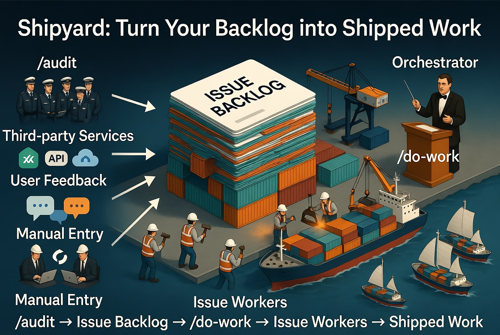

<p align="center">
  
</p>

> ## 🚨 Experimental — read before you run this against anything important 🚨
>
> The shipyard plugin runs an **autonomous code-modification loop** — it
> edits files, pushes branches, opens PRs, and arms auto-merge on PRs once their CI goes green. Before
> using it on a repo you care about:
>
> - **Treat it as experimental.** Behavioral bugs around termination, dispatch fairness, and worker
>   isolation are still being shaken out. Behavior will change between commits.
> - **Treat it as potentially unsafe.** Safety is enforced primarily through prompt discipline rather
>   than architectural sandboxing. The tool has broad permissions by design — file system, `git`, `gh`,
>   hook execution.
> - **Treat it as expensive.** Parallel `/do-work` workers each pay full per-context costs; recursive
>   audit / refine flows can dispatch deep agent trees. Start with `--concurrency 1` and watch the
>   billing dashboard before scaling.
> - **Limited automated testing.** Bash unit tests cover the supporting scripts and hooks
>   (run by `.github/workflows/tests.yml`), but the skills, commands, and agents themselves are markdown
>   specs without automated behavior verification — that side is manual + dogfooding.
> - **No API stability.** Slash-command shape, skill interfaces, and agent contracts evolve fast.
>   Pin to a specific commit if you need reproducibility; expect drift between updates.
> - **No support.** No SLA, no incident response, issues triaged at the author's discretion.
>
> Recommended posture for first-time use: a throwaway repo, `--concurrency 1`, default-deny Claude
> Code permissions, and a billing alert on your Anthropic account.

# Shipyard

An experimental [Claude Code](https://docs.claude.com/en/docs/claude-code) plugin — an autonomous engineering loop that finds work via audits, refines raw user feedback into actionable tickets, and burns down the backlog with a rolling pool of parallel workers in isolated git worktrees.

<p align="center">
  
</p>

*Shipyard at a glance — five stages of the autonomous engineering loop. Read the [How it works](#how-it-works) section below for details.*

## Quick start

Get from zero to your first auto-merging PR in about five minutes.

### Prerequisites

- [Claude Code](https://docs.claude.com/en/docs/claude-code) installed and signed in.
- The [GitHub CLI](https://cli.github.com/) (`gh`) installed and authenticated (`gh auth login`). Shipyard drives every GitHub interaction through `gh`.
- A local checkout of a GitHub repo with at least one open issue. Branch protection / required CI checks are fine — shipyard arms auto-merge and lets the merge train do the rest.

### 1. Install the plugin

```sh
claude plugin marketplace add mattsears18/shipyard
claude plugin install shipyard@shipyard
```

Then run `/reload-plugins` so the new slash commands register.

### 2. Run your first command

From inside any GitHub-connected repo, try one of these:

```sh
# Burn down the backlog — pick up open issues and ship PRs in parallel.
# Start at --concurrency 1 for your first run (see the warning box above);
# scale up once you've watched a session and your billing dashboard.
/do-work --concurrency 1

# Find work — audit a live URL for performance, SEO, a11y, and best-practices,
# and autonomously file an issue per finding.
/audit lighthouse https://your-app.example.com

# Refine issues that aren't ready for /do-work yet (source-branched):
# user-feedback classify+rewrite, open-questions resolve-defaults, or
# fall-through to needs-human-review when no refiner rule matches.

# Auto-decompose confirmed epics (needs-human-review + the
# <!-- do-work-needs-decomposition --> body marker) into dispatch-ready
# sub-issues so the sub-work re-enters /do-work without a human round-trip.

# Walk through everything that genuinely needs YOU (decisions, judgment calls
# nothing can complete for you), one item at a time, until the queue is empty
# — the interactive human counterpart to /do-work.
/my-turn

# /do-work is autonomous AND operator-inclusive by DEFAULT — it burns down the
# backlog AND drives browser-completable operator actions in your real, logged-in
# Chrome (close a superseded PR, paste a CI secret, toggle a console setting).
# A self-onboarding preflight (browser extension, gh auth, site permissions)
# runs automatically at session start; --dry-run previews it without touching
# anything. Opt OUT with --no-operate / --hands-off for a code-only run.
/do-work
/do-work --dry-run
/do-work --no-operate

# Walk a decision-gated issue's blocking decisions one-by-one (with a
# recommendation for each), record the answers, and clear the gate so
# /do-work can pick it up — the mutating sibling /my-turn reuses.
/resolve-decisions --issue 1816
```

**Which do I run?** Three commands, one clear division of labor:

| Command | What it does | Loops? |
|---|---|---|
| `/do-work` | Autonomous continuous loop — **code work + browser operation** (picks issues, opens PRs, arms auto-merge, keeps `main` green, **and** drives browser-completable operator actions). **Operator-inclusive and autonomous by default** ([#661](https://github.com/mattsears18/shipyard/issues/661)); it makes reasonable design/architecture decisions itself rather than round-tripping — security / access-control settings are the sole hand-back class | yes (autonomous) |
| `/do-work --no-operate` (= `--hands-off`) | Opt out of the browser-operator layer — the rare **code-only, dispatch-only** run: dispatches workers, opens PRs, arms auto-merge, but never drives the browser (operator items are handed back) | yes (autonomous) |
| `/my-turn` | Surfaces **only** what genuinely needs *you* — decisions and judgment calls the loop can't complete — and **walks you through them one at a time**, advancing until the human-only queue is empty | yes (interactive, human-paced) |

Rule of thumb: if a machine could finish it (code, or a browser click), it's `/do-work`'s job (by default — pass `--no-operate` / `--hands-off` to keep it to code only); if it needs *your* decision or judgment, `/my-turn` walks you through it.

### 3. Watch the loop

When you run `/do-work`, you'll see:

- A markdown table of the ranked backlog at start (and again at end of session).
- A one-line status header printed before the initial pool fill (and re-printed whenever repo-health state changes — main going red, a divert firing, the failing-PR count crossing the threshold).
- `--concurrency N` parallel workers, each in its own isolated git worktree under `.claude/worktrees/`, opening PRs that close their assigned issues. Each PR has auto-merge with squash armed — green CI means it merges itself.

When `/audit` runs, you'll see filed issues with severity labels (`P0`/`P1`/`P2`) and an audit-key HTML comment for dedup.

### Next steps

- Read [How it works](#how-it-works) for the full four-phase loop (inputs → refine → human review → orchestrator → workers → PR).
- Skim [What's been hardened](#whats-been-hardened) for the safety properties that keep autonomous runs from clobbering your repo.
- Wire up a Sentry / Datadog / Dependabot integration that files GitHub issues — see [Plays well with everything that files GitHub issues](#plays-well-with-everything-that-files-github-issues).

## Updating

Shipyard is moving fast — expect frequent releases. The one-keystroke path:

```sh
/shipyard:update
```

That runs the marketplace refresh and the plugin update in order, then prompts you to run `/reload-plugins` so the refreshed slash commands, agents, and hooks register. (A slash command can't reload the plugin it's a member of — that's why `/reload-plugins` is a separate step.)

See [`CHANGELOG.md`](./CHANGELOG.md) for what's in each release. Pin to a specific commit if you need reproducibility — the experimental-status warning at the top of this README applies, and slash-command shape, skill interfaces, and agent contracts evolve between updates.

## What it does

An autonomous engineering loop for web + mobile app development. Three things it does:

1. **Finds work** — `/audit` runs deep audits across UX, performance, security, accessibility, DX, privacy, PWA readiness, release readiness, SEO, marketing / conversion, tech debt, testing, docs, observability, API surface health, and data-model lifecycle integrity, and autonomously files GitHub issues for every finding. One dimension is different in kind: `comprehension` is **generative, not assertive** — instead of checking the codebase against a rubric and filing defects, it reads the codebase and writes down what it actually does (feature inventory, state machines, data flows, invariants), committed so successive runs produce a reviewable diff. Only its "surprises" section — behavior that looks unintentional or inconsistent — files GitHub issues; the rest of the document is never filed as one.
3. **Does work** — `/do-work` orchestrates a rolling pool of parallel issue-workers, each in an isolated git worktree. It dispatches up to `--concurrency` workers at once, opens PRs with auto-merge, and gracefully handles failing checks, red main CI, and PR pileups via specialized diversion workers.

**Slash commands:**

- `/audit lighthouse <url>` — perf / SEO / best-practices / agentic browsing via Lighthouse
- `/audit web-ux <url>` — live tour via Chrome DevTools MCP
- `/audit mobile-ux` — review of stored screenshots (`store-assets/screenshots/{ios,android}/*`)
- `/audit ux <url>` — web-ux + mobile-ux in parallel
- `/audit functional-qa <url>` — live click-through of core user flows, verifying they actually complete rather than just render
- `/audit security <url>` — deps, secrets in git, Firebase rules, headers, mobile manifests
- `/audit a11y <url>` — Lighthouse a11y category + manual keyboard / screen-reader tour
- `/audit seo <url>` — sitemap, structured data, OG/Twitter cards, canonical URLs, image alt text, internal link graph
- `/audit marketing <url>` — landing-page value-prop + primary CTA, funnel dead-ends, store-listing persuasiveness gaps, cross-surface positioning consistency (evidence-anchored, not taste — defers to repo brand/voice docs)
- `/audit privacy <url>` — GDPR / CCPA / COPPA: cookie banners, ATT prompts, account-deletion flow, ASC + Play privacy forms
- `/audit pwa <url>` — manifest completeness, service worker behavior, offline fallback, install prompt UX, icon coverage
- `/audit release-readiness` — CHANGELOG ↔ store-metadata sync, app-icon coverage, splash screens, deep-link asset files, version bumps
- `/audit dx` — developer-experience catalog (lints, hooks, observability, contributor docs, etc.)
- `/audit tech-debt` — stale TODO/FIXME markers, dead feature flags, deprecated internal APIs still in use, outdated deps
- `/audit testing` — coverage holes on critical paths, empty / tautological / mock-only tests, CI gate completeness
- `/audit docs` — README drift, broken links, docstring drift from signatures, missing ADRs, stale dated TODOs in docs
- `/audit observability` — error-tracking effectiveness, structured-logging consistency, tracing coverage, alert config
- `/audit api` — OpenAPI / GraphQL schema drift, missing pagination, inconsistent auth and error envelopes, breaking-change diffs
- `/audit data-lifecycle` — data-model mutation integrity: orphaned records after a parent delete, denormalized snapshots that drift on update, missing cascades / back-reference cleanup, ephemeral/counter collections with no GC/TTL
- `/audit comprehension` — **generative, not assertive**: produces a "what this app actually does" document (feature inventory, state machines, data flows, cross-cutting invariants), proposed via a tracking issue for a later `/do-work` dispatch to commit at `docs/COMPREHENSION.md` so successive runs yield a reviewable diff. Only its "Surprises" section — behavior that looks unintentional or inconsistent — files GitHub issues; the descriptive sections never do.
- `/audit all <url>` — every audit in parallel. **This is also the default** — running bare `/audit` (or `/audit <url>` with no type) dispatches `all` rather than prompting you to pick one.
- [`/shipyard:audit-scheduled`](plugins/shipyard/commands/audit-scheduled.md) — run only the `/audit` dimensions whose configured cadence (`audits.schedule` in `shipyard.config.json`) is actually due, so an auditor like `testing` or `functional-qa` catches drift on a recurring basis instead of only when a maintainer already suspects a problem. A thin cadence gate in front of `/audit`'s own dispatch table — no new execution engine, and idempotent for free via the existing `audit-key` dedup. Composes with `/loop` (`/loop 1h /shipyard:audit-scheduled`) for cron-like cadence checking without wiring an external scheduler. `--dry-run` previews what would run. See the [Scheduled audits](#scheduled-audits-auditsschedule-config-block--issue-975) section below for a worked example.
- `/do-work` — burn down the issue backlog with a rolling pool of parallel workers. **Autonomous continuous loop — code work *plus* browser operation, operator-inclusive by default** ([#661](https://github.com/mattsears18/shipyard/issues/661)): it drives browser-completable operator actions in your real, logged-in Chrome and makes reasonable design/architecture decisions itself rather than round-tripping — security / access-control settings are the sole hand-back class. Pass `--no-operate` / `--hands-off` for a rare code-only, dispatch-only run. The operator layer is backend-agnostic — it prefers the first-party **Claude Chrome extension** (`claude-in-chrome`, which inherits your logged-in sessions with no setup), falls back to `chrome-devtools-mcp`, and drops to the code-only loop if neither is available — and runs a self-onboarding **preflight** at session start (diagnoses missing `gh` auth / extension / site permissions and walks you through fixing them; silent when already configured). `--dry-run` previews without acting; `--record` captures browser actions as GIFs.
- `/my-turn` — the **human counterpart**: surfaces only the items that genuinely need *you* — decisions and judgment calls nothing can complete for you — and **walks you through them one at a time, advancing to the next until the human-only queue is empty**. Interactive and human-paced (it dispatches no agents and shares none of `/do-work`'s machinery); for a decision-gated issue it reuses [`/resolve-decisions`](plugins/shipyard/commands/resolve-decisions.md)' one-by-one walkthrough to record the answers and clear the gate. Browser-completable operator actions and code work are **excluded** — those belong to `/do-work` (operator-inclusive by default). (`--all` / `--limit N` render a static snapshot of the queue instead of walking it; `--chrome-prompt` emits a copy-paste prompt for the Claude Chrome extension.)
- `/resolve-decisions` — interactively walk a decision-gated `needs-human-review` issue's blocking decisions one at a time (each with context, options, and a concrete recommendation+reasoning), then record the answers as a structured issue comment and remove the gating label so `/do-work` can pick it up. The mutating sibling `/my-turn` reuses for its decision walkthroughs.
- `/shipyard:init` — scaffold a `shipyard.config.json` with layered overrides for concurrency, label namespaces, and per-mode caps. See [`CLAUDE.md`'s "Configuration" section](./CLAUDE.md#configuration-shipyardconfigjson--layered-overrides) for the layering model.
- `/shipyard:config show|get|set|edit|validate` — inspect or update the effective merged config across the four layers (built-in defaults, user-global, repo, personal override).
- `/shipyard:cost report` — query the persistent cost-history ledger at `~/.shipyard/cost-history.jsonl`; filter by repo, mode, model, or issue. See [`CLAUDE.md`'s "Cost-tracking ledger" section](./CLAUDE.md#cost-tracking-ledger-shipyardcost-historyjsonl).
- `/shipyard:status` — live dashboard of in-flight `/shipyard:do-work` workers (mode, target, elapsed, tokens, stale detection).
- `/shipyard:update` — one-keystroke shipyard update; prompts you to run `/reload-plugins` once the refresh lands. See the [Updating section](#updating) above.
- `/shipyard:version` — print the installed plugin's version (`plugin.json`'s `.version`, resolved from the actually-loaded install, not whatever's checked out locally).
- `/shipyard:eas-watch` — surface failed EAS (Expo Application Services) builds in real time: polls recent builds, diffs against per-project state at `~/.shipyard/eas-state.json`, and optionally files `audit:eas-build`-labeled issues for new failures. Composes with `/loop` (`/loop 5m /shipyard:eas-watch`) for cron-like polling without wiring an EAS webhook.
- `/shipyard:file-issue [--quick] <description>` — discoverable entry point for filing a **dispatch-ready** issue against the current repo. Searches for duplicates, **researches the codebase** so the issue cites real file paths, **refines it to dispatch-readiness** (concrete acceptance criteria, no gate label by default), and files via `gh issue create` — using the [`filing-github-issues`](plugins/shipyard/skills/filing-github-issues/SKILL.md) skill (Conventional Commits title, label discovery, body template) and the [`audit-rubrics`](plugins/shipyard/skills/audit-rubrics/SKILL.md) severity rules (P0/P1/P2). **Files only — it never starts the work** (no branch, no PR, no edits). Pass `--quick` to skip the research + refinement passes and file a thin issue straight from the description. For the human-in-the-loop case — auditors and `/do-work` workers file via the skill directly.
- [`/shipyard:update-roadmap`](plugins/shipyard/commands/update-roadmap.md) — bring the repo's milestone roadmap current: assign a milestone to every open issue that lacks one, author new phases (including cold-start on a repo with zero milestones), check each phase's stated bet against reality, detect issue dependencies a filer never wrote down, and surface the judgment calls a human should make. Applies the mechanical/reversible cases directly, proposes everything that re-sequences a human-authored plan. **Orchestrator-only** — a dispatched `/shipyard:do-work` worker must never invoke it. Gated on `milestones.enabled` (see the [Milestone-sequenced roadmap](#milestone-sequenced-roadmap-milestones-config-block--issue-1239) section below). `--dry-run` previews without writing.

Each audit runs in an isolated subagent, files its own issues using the shared `filing-github-issues` skill (Conventional Commits titles, label discovery, duplicate search), and respects the severity rules in `audit-rubrics` (P0–P2). Fully autonomous — no per-step approval gates.

## How it works

The loop has four phases, and the orchestrator drives them on every iteration of `/do-work`:

1. **Inputs.** Issues arrive from multiple sources, all unified at the GitHub-issue layer. The `/audit` family files them autonomously — a Lighthouse pass on a live URL, a Chrome DevTools tour, a security sweep, an a11y audit, etc. — each finding becomes a labeled GitHub issue with severity (`P0`/`P1`/`P2`). Your app's feedback form posts raw user reports via a backend proxy that opens issues carrying `user-feedback`. Humans file issues through the [GitHub issue template chooser](.github/ISSUE_TEMPLATE/) (`bug_report`, `feature_request`, `user_feedback`). There's no intake-time gate label — refinement candidates are detected just-in-time by `/refine-issues`' source-signal scan (external authors, bodies with unresolved `## Open questions`, bare one-liners, and bot-authored issues) as a pre-dispatch pass; the separate `external-author-gate.yml` still gates stranger-authored issues with `needs-human-review` at intake.


3. **Human review.** You scan the refined backlog, drop `needs-human-review` from the ones you want shipped, and run `/do-work`. This is the only required human step. Everything before it (audits filing, feedback refining) and everything after (dispatch, fix-up, merge) is autonomous. Run [`/my-turn`](plugins/shipyard/commands/my-turn.md) to be walked through the items that genuinely need *you* — decisions and judgment calls neither loop can complete — one at a time until the human-only queue is empty.

4. **Orchestrator → workers → PR.** `/do-work` ranks the eligible backlog, then keeps `--concurrency` workers in flight at all times. Each dispatch is one of seven `mode:` values: `issue-work` (the common case — implement, open a PR, close the issue), and six specialized diversions the orchestrator fires when repo health needs attention — `fix-checks-only` (repair a failing PR's CI), `fix-rebase` (drain-phase rebase of a DIRTY PR), `fix-main-ci` (repo-level: fix the earliest red run on the default branch), `fix-failing-prs-batch` (repo-level: source-fix a common root cause behind a PR pileup), `investigate` (work an untriaged / Sentry-authored issue end-to-end to a disposition), and `spike` (feasibility/research issue → design doc → decomposition → optional implementation). Every `issue-work` dispatch is implemented in an isolated git worktree on a deterministic branch (`do-work/issue-<N>`), implements the smallest change that satisfies the acceptance criteria, opens a PR that closes the issue, and enables auto-merge with squash. An opt-in **verify gate** (`verify_gate.enabled` in config) can dispatch an independent adversarial-review agent to judge the change against the issue's acceptance criteria before auto-merge is armed. Green CI = merged = the next worker slot opens. When CI goes red, an in-progress PR fails its checks, or the default branch breaks, the orchestrator diverts a worker to fix it before resuming normal backlog work.

The result: you write issues (or let `/audit` write them), you sign off on the user-feedback ones, and the rest of the chain runs without you.

### Dispatch substrate — the `Agent` tool

Every `mode:`-driven worker is dispatched via Claude Code's `Agent` tool with `isolation: "worktree"` — the harness provisions and cwd-pins the worktree in response, and a `PreToolUse` hook hard-fails any guarded dispatch that omits the isolation parameter. This is the dispatch shape as of [#825](https://github.com/mattsears18/shipyard/issues/825), which restored it after the prior [Dynamic Workflows](https://code.claude.com/docs/en/workflows) migration ([#782](https://github.com/mattsears18/shipyard/issues/782)) found the `Workflow` runtime's dispatched workers could not perform a single file write. The dispatch returns a terminal string in the per-mode return vocabulary defined by [`schemas/worker-return.schema.json`](plugins/shipyard/schemas/worker-return.schema.json). See [`dispatch-rules.md`](plugins/shipyard/commands/do-work/dispatch-rules.md#dispatch-rules-used-by-step-7-and-step-c) — the authoritative spec — for per-mode call-site details, rather than re-deriving the mechanics here. A deterministic JavaScript orchestration script served as an alternate substrate for the same seven modes until [#1654](https://github.com/mattsears18/shipyard/issues/1654) removed it: `Agent`-tool `isolation: "worktree"` provides the isolation its `agent()` primitive lacked, which was the only reason it needed its own worktree pre-provisioning in the first place.

The `Agent` tool is *also* used for dispatches that never carry a `mode:` value — the opt-in verify gate, the epic-decomposition worker, and the read-only scope-preflight / refinement workers — it is the shape for the seven `mode:`-driven workers too.

> **⚠️ Upgrading from ≤ 3.1.x:** the `dispatch.substrate` config knob is **removed as of `4.0.0`** and was **not** reintroduced when #825 restored `Agent`-tool dispatch — there's no flag to set either way, and as of `4.59.0` there is a single dispatch shape (see above). Delete any `dispatch` block from `shipyard.config.json` / `.shipyard/config.local.json` before upgrading: the config schema is `additionalProperties: false`, so a layer that still carries one now **fails validation** (`/shipyard:config validate` reports it; `shipyard-config.sh load` exits 70) instead of being silently ignored.

### Label conventions

Shipyard treats several label families as load-bearing — origin labels (`user-feedback`, `audit:<dimension>`), the session-stamp label (`shipyard`), state labels in the `blocked:*` namespace (`blocked:agent-soft`, `blocked:ci`), and gate labels (`needs-human-review`, `agent-console`). `agent-console` (browser/console actions `/do-work` drives itself by default via `claude-in-chrome` — see the [Quick start](#quick-start) `/do-work` example above) is distinct from `needs-human-review` (genuine human decisions). The canonical reference lives in [`CLAUDE.md`'s "Label conventions" section](./CLAUDE.md#label-conventions) — that's the source of truth; this README intentionally doesn't duplicate it.

### Observability — per-session token cost

Every `/do-work` session writes per-session token-usage data to `~/.shipyard/sessions/<session-id>.json` and posts cost-tracking comments on the issues and PRs it touches, so you can see at a glance how much a given backlog burndown cost. End-of-session, each run flushes a rolled-up record to the persistent ledger at `~/.shipyard/cost-history.jsonl`; query historical spend with `/shipyard:cost report` (filterable by repo, mode, model, or issue — see [`CLAUDE.md`'s "Cost-tracking ledger" section](./CLAUDE.md#cost-tracking-ledger-shipyardcost-historyjsonl)). Useful for tuning `--concurrency`, deciding which audits are worth running on a cron, and spotting agents that are spending too many tokens for the work they ship.

### Scheduled audits (`audits.schedule` config block — issue [#975](https://github.com/mattsears18/shipyard/issues/975))

`shipyard:testing-auditor` and `shipyard:functional-qa-auditor` (and every other `/audit` dimension) are invoke-on-demand only — nothing runs them unless a human types `/audit <dimension>`. That means drift surfaces only once a maintainer already suspects a problem, which is exactly the case where an auditor adds the least value. `audits.schedule` in `shipyard.config.json` names dimensions + a recurring cadence; [`/shipyard:audit-scheduled`](plugins/shipyard/commands/audit-scheduled.md) reads it, checks a small last-run state file at `~/.shipyard/audit-schedule-state.json`, and dispatches only the dimensions actually due — reusing `/audit`'s own dispatch table and the `audit-key` fingerprint dedup already built into `filing-github-issues`, so a scheduled run that finds nothing new files nothing (no issue churn). The command composes with the existing `/loop` skill for the actual periodic trigger, the same pattern `/shipyard:eas-watch` already uses — `audits.schedule` decides *whether* a dimension is due; `/loop` decides *how often to check*.

Worked example — weekly `testing` + `functional-qa`, daily `security`:

```json
{
  "version": 1,
  "audits": {
    "schedule": [
      { "dimension": "testing", "cadence": "7d" },
      { "dimension": "functional-qa", "cadence": "7d", "url": "https://app.example.com" },
      { "dimension": "security", "cadence": "24h" }
    ]
  }
}
```

```bash
/loop 1h /shipyard:audit-scheduled
```

The loop checks hourly; `security` actually dispatches daily, `testing`/`functional-qa` weekly — each only spending tokens/CI time on the day its cadence rolls over. `cadence` accepts `<int>m` / `<int>h` / `<int>d` / `<int>w` (minutes/hours/days/weeks). Set `"enabled": false` on an entry to keep it documented in config without running it. Run `/shipyard:audit-scheduled --dry-run` any time to preview what's due without dispatching anything.

### CI-minute discipline (`ci.*` config block — issue [#323](https://github.com/mattsears18/shipyard/issues/323))

`/do-work` can rack up GitHub Actions minutes on repos with expensive CI suites (E2E shards, Lighthouse, accessibility audits) when it speculatively retriggers full CI suites — failing-PR re-dispatches against stale failures, drain-phase fix-rebase force-pushes on every DIRTY PR, etc. The `ci.*` block in `shipyard.config.json` provides five operator-tunable knobs that cap the spend; all default to pre-#323 behavior so adopting them is opt-in.

| Key | Default | Effect when flipped |
|---|---|---|
| `ci.skip_drain_rebase` | `false` | Drain phase skips ALL fix-rebase dispatch. DIRTY PRs surface as "needs manual rebase" in the summary instead of consuming one full CI suite per force-push. |
| `ci.max_drain_rebases` | `null` | Soft cap on drain-phase fix-rebase dispatches per session. Dispatches the top-N (lowest PR number first) and surfaces the rest. |
| `ci.verify_check_failing_on_head_before_dispatch` | `false` | Before fix-checks dispatch, verify the failing check's run-SHA matches the PR's current `headRefOid`. Drop the dispatch if stale (failure already pushed past). |
| `ci.require_in_progress_check_to_settle` | `false` | If a `failed_prs` candidate has any check still IN_PROGRESS on the current head, defer dispatch until the run settles. Prevents the double-push case. |
| `ci.skip_speculative_rerun` | `true` | Codifies the absence of `gh run rerun` calls. Default-true (the orchestrator doesn't issue reruns anywhere in the current spec); flipping it allows a future change to enable speculative reruns. |

End-of-session summary surfaces a `CI cost (#323):` block whenever any `ci.*` key is non-default OR any counter is non-zero, with a per-key breakdown and an `Estimated CI suites avoided this session: N` total. Detailed rationale and a worked example live in [`do-work-RATIONALE.md → CI-minute discipline`](./plugins/shipyard/commands/do-work-RATIONALE.md#ci-minute-discipline-issue-323).

### Milestone-sequenced roadmap (`milestones` config block — issue [#1239](https://github.com/mattsears18/shipyard/issues/1239))

By default, `/do-work` ranks its backlog by `P0` > `P1` > `P2` > unlabeled, then staleness — a flat priority queue with no notion of *sequence*, so "urgent" and "comes first in the roadmap" are conflated. The top-level `milestones` block adds shipyard-owned roadmap sequencing, independent of every other config block: numbered phases (`1 · Foundation`, `2 · Polish`, …) that later dispatch and filing-time features can order by, plus a fallback milestone (default `Ongoing maintenance`) that never completes and always sorts last for issues that fit no phase.

**When `milestones.enabled` and `milestones.prioritize_dispatch` are both `true`, backlog ranking becomes milestone-aware** (issue [#1241](https://github.com/mattsears18/shipyard/issues/1241)): a `P0` still outranks everything, anywhere in the roadmap (an emergency escape, not part of the plan); below that, an explicit `--prioritize-label` run override; below that, the earliest phase with dispatchable work — a `P1` sitting in phase 1 now dispatches before a `P1` sitting in phase 3, which is the entire point of having sequenced the work in the first place. `P1` > `P2` > unlabeled, then type, then staleness remain as low-stakes tiebreakers *within* whichever phase is current. A phase that stalls on a `needs-human-review` item never blocks the loop — dispatch falls through to the next phase with agent-actionable work, so the roadmap never idles the session against a bottleneck only a human can clear. With either config key `false` (the default), ranking is byte-identical to a repo with no `milestones` block at all — see [`backlog-filter.sh`](plugins/shipyard/scripts/backlog-filter.sh)'s `classify` subcommand, the normative implementation, and [`do-work-RATIONALE.md → Milestone-aware backlog ranking`](plugins/shipyard/commands/do-work-RATIONALE.md#milestone-aware-backlog-ranking--backlog-filtersh-classifys-_sort_key-and-why-the-tiers-sit-where-they-do-issue-1241) for the full tier-by-tier design writeup.

```json
{
  "version": 1,
  "milestones": {
    "enabled": true,
    "fallback": "Ongoing maintenance",
    "assign_on_file": true,
    "prioritize_dispatch": true,
    "sweep_on_loop_end": true
  }
}
```

**`enabled` defaults `false` and is the master switch** — every other key is inert while it's false, and a repo with no `milestones` block at all behaves identically. `/shipyard:init` offers to turn it on (step 9.8). **Issue #1239 shipped the config surface only** — schema, accessor defaults, and the `/shipyard:init` offering. Each key is consumed by exactly one downstream feature: `assign_on_file` by issue-filing paths (#1242), `prioritize_dispatch` by `/do-work`'s backlog ranking (#1241), `sweep_on_loop_end` by an end-of-loop milestone-hygiene pass (#1243) — so the feature degrades cleanly if only some of them land. See [`do-work-RATIONALE.md → milestones config block`](./plugins/shipyard/commands/do-work-RATIONALE.md#milestones-config-block--config-surface-only-scope-and-why-projects-projects-v2-was-dropped-issue-1239) for the full design-decision writeup, including why a GitHub Projects v2 (`projects`) block was designed alongside this and deliberately dropped.

**[`/shipyard:update-roadmap`](plugins/shipyard/commands/update-roadmap.md) (issue #1240) is the first consumer** — it reads `enabled` and `fallback` to assign missing milestones, author new phases (including cold start), check phase bets against reality, and detect dependencies. It's a port of `mattsears18/lightwork`'s repo-local `update-roadmap` skill, generalized off that repo with the GitHub Projects v2 half removed. See [`plugins/shipyard/skills/update-roadmap/SKILL.md`](plugins/shipyard/skills/update-roadmap/SKILL.md) for the full autonomy boundary (mechanical/reversible applies directly, strategy-changing proposes) and [`do-work-RATIONALE.md → shipyard:update-roadmap skill`](./plugins/shipyard/commands/do-work-RATIONALE.md#shipyardupdate-roadmap-skill--why-the-worker-prohibition-is-a-separate-fragment-why-dependency-detection-splits-applypropose-the-way-it-does-and-the-source-unreachable-fallback-issue-1240) for the design writeup.

**`assign_on_file` (issue #1242) is the second consumer** — every issue-filing path assigns a milestone at file time instead of waiting for the next roadmap sweep to backfill it: [`shipyard:filing-github-issues`](plugins/shipyard/skills/filing-github-issues/SKILL.md#milestone-assignment-gated-on-milestonesenabled--milestonesassign_on_file-issue-1242) (the shared path all 18 `*-auditor` agents file through) and [`/shipyard:file-issue`](plugins/shipyard/commands/file-issue.md) both match the new issue against each open milestone's `BET:` — never against keywords in the issue's title — falling back to the `fallback` milestone only when it already exists, and filing without one when nothing fits or the lookup fails. Neither path ever creates a milestone; that stays `shipyard:update-roadmap`'s job alone. `/decompose-epic` inherits the parent epic's own milestone onto every sub-issue it shards, rather than re-deriving one. All three are inert while either `enabled` or `assign_on_file` is `false` — filing is then byte-for-byte identical to a repo with no `milestones` block. See [`do-work-RATIONALE.md → Milestone assignment at filing time`](./plugins/shipyard/commands/do-work-RATIONALE.md#milestone-assignment-at-filing-time--matching-against-bet-why-a-filer-never-creates-a-phase-and-sub-issue-inheritance-issue-1242) for the design writeup.

**`sweep_on_loop_end` (issue #1243) is the third consumer** — when it and `enabled` are both `true`, `/do-work`'s own end-of-session cleanup runs `shipyard:update-roadmap`'s Procedure steps 1–6 ([`cleanup-summary.md`'s step 8.5](plugins/shipyard/commands/do-work/cleanup-summary.md#end-of-session-cleanup)) right before the session summary renders, and folds the Applied/Proposed tallies into that same summary's `Roadmap sweep (#1243):` line instead of posting a second, separate report. The sweep self-skips (no reads, no summary line) when this session shipped and filed nothing, and any sweep-side failure is caught and reported as a one-line advisory — it never fails the loop or blocks the summary. `/shipyard:audit` deliberately does **not** get the identical auto-wiring (a shorter run filing far fewer findings per invocation makes the added machinery a worse trade there); running `/shipyard:update-roadmap` after a bulk audit is the operator's own call — see [`audit.md`'s "End-of-run summary" section](plugins/shipyard/commands/audit.md#end-of-run-summary). See [`do-work-RATIONALE.md → End-of-loop milestone roadmap sweep`](./plugins/shipyard/commands/do-work-RATIONALE.md#end-of-loop-milestone-roadmap-sweep--why-its-non-fatal-why-it-skips-on-a-no-op-loop-and-why-the-skills-own-step-7-report-is-suppressed-here-issue-1243) for the full design writeup.

## What's been hardened

A non-exhaustive list of safety properties the orchestrator and workers carry today. Each bullet links to the PR or issue where the property landed:

- The orchestrator never goes idle while workable backlog or open `@me` PRs remain — a structured invariant line prints every turn so going-quiet-with-work-left is detectable ([#23](https://github.com/mattsears18/shipyard/issues/23)).
- User feedback enters via a backend-mediated intake and is refined + human-gated before any code-modifying agent runs against it ([#24](https://github.com/mattsears18/shipyard/issues/24)).
- Workers are forbidden from `git commit --no-verify` and equivalent hook bypasses, enforced both at the prompt and by the `refuse-hook-bypass-flag.sh` `PreToolUse` hook ([#26](https://github.com/mattsears18/shipyard/issues/26), [#1511](https://github.com/mattsears18/shipyard/issues/1511)).
- The orchestrator re-checks the backlog before every dispatch — issues filed mid-session don't have to wait for a periodic refresh to be picked up ([#29](https://github.com/mattsears18/shipyard/issues/29)).
- A `PreToolUse` hook mechanically enforces worktree isolation for both dispatch shapes — a `Workflow` call whose work unit carries no `worktreePath`, and an `Agent` call missing `isolation: "worktree"` — so workers operate in a dedicated worktree and never touch the user's primary checkout's HEAD ([#34](https://github.com/mattsears18/shipyard/issues/34), [#791](https://github.com/mattsears18/shipyard/issues/791)).
- Every worker asserts its own cwd is actually the isolated worktree (not the primary checkout) at dispatch start — a harness-level cwd misroute now bails immediately instead of implementing the whole task and dying at the final commit ([#486](https://github.com/mattsears18/shipyard/issues/486)).
- The orphan-triage sweep liveness-checks a worktree's lock-holding PID before reaping it, so a still-running worker's worktree isn't pulled out from under it ([#253](https://github.com/mattsears18/shipyard/issues/253)).
- Termination is decided on a fresh backlog fetch, not a stale snapshot — the loop can't declare "zero matching issues remain" while workable issues actually exist ([#195](https://github.com/mattsears18/shipyard/issues/195)).
- Token attribution is mandatory — every dispatch's usage is recorded to the per-session ledger so cost is always traceable ([#197](https://github.com/mattsears18/shipyard/issues/197)).
- A model missing from the cost-tracking pricing table is flagged as a lower bound, never silently priced at $0.00 — CI fails if a shipped model id has no pricing row ([#728](https://github.com/mattsears18/shipyard/issues/728)).
- Label changes are audited by a workflow that alerts on (and can revert) unauthorized label mutations ([#140](https://github.com/mattsears18/shipyard/issues/140)).
- Every worker runs a rolling pre-flight before it starts, so each dispatch re-confirms the issue is still workable rather than trusting the orchestrator's pick ([#233](https://github.com/mattsears18/shipyard/issues/233)).

## See it in action

**Shipyard is built with shipyard.** The majority of merged PRs in this repo were opened by `/do-work` workers — each one opened, fixed-up through CI failures (if any), and merged without a human touching the keyboard between issue triage and PR review. The `shipyard` label stamps every PR the orchestrator produces. Browse the living demo:

- [**Issues →**](https://github.com/mattsears18/shipyard/issues?q=is%3Aissue) — the backlog the orchestrator has been working, plus the closed ones with their resolving PRs linked
- [**`shipyard`-labeled closed PRs →**](https://github.com/mattsears18/shipyard/pulls?q=is%3Apr+is%3Aclosed+label%3Ashipyard) — the merged outputs

## Plays well with everything that files GitHub issues

Shipyard doesn't care **where** an issue came from — it only cares that the issue exists, is open, and isn't already assigned to someone else. That makes it compose with any service that can file GitHub issues:

- **Sentry** → auto-files issues for new production exceptions. Shipyard reproduces the bug, ships a fix, closes the Sentry issue.
- **Datadog / New Relic / Honeycomb** → file issues for SLO breaches and anomalies. Shipyard investigates and fixes the underlying cause.
- **Dependabot / Renovate** → file PRs for outdated/vulnerable dependencies. Shipyard picks up the open issues those tools file and resolves them.
- **GitHub Advanced Security / CodeQL** → file issues for code-scanning findings. Shipyard fixes the vulnerability or files a justified suppression.
- **Customer support tools (Zendesk, Intercom)** → many have GitHub integrations that file issues from support tickets. Shipyard treats those just like user feedback (filed with the `user-feedback` label → refined → human-reviewed → worked; see [Refines work](#what-it-does) above and the `/refine-issues` flow — the user-feedback classify+rewrite branch).
- **Your own infrastructure** — anything you wire up via the GitHub API to file issues.

The pattern: every "thing that's broken" becomes a GitHub issue, shipyard works the issue, the fix ships. The app becomes **effectively self-healing** — production errors don't sit until a human notices; they sit until shipyard's next dispatch.

### Concrete example: Sentry round-trip

1. A user hits a `NullPointerException` in your app. Sentry catches it.
2. Sentry's GitHub integration files a new issue: "NullPointerException in `OrderService.calculateDiscount`" with stack trace + frequency + affected user count.
3. Shipyard's `/do-work` is running (locally, in CI on a cron, or invoked manually). On its next backlog refresh, it picks up the new issue.
4. The dispatched worker reproduces the failure (per the mandatory-repro rule), writes a failing test, fixes the null check, commits, opens a PR with `Closes #N`, enables auto-merge.
5. CI runs green. PR auto-merges. Sentry's issue closes automatically (via the `Closes #N` line). The fix is deployed on your next release.

Total human intervention: **zero**, modulo whatever review process you keep at the PR level (branch protection, required reviewers, etc.).

The Sentry flow above is illustrative, not a case study — your mileage depends on the quality of the upstream issue and the kind of bug. See the caveats below.

### Caveats

- **Quality of the upstream issue matters.** A clean Sentry stack trace is great; a one-line "something broke" issue is not. The better the auto-filer's report, the better the fix.
- **Not everything is auto-fixable.** Shipyard returns `blocked` on issues it can't repro or for which it can't infer a fix. Those still need humans — but they were going to need humans anyway. The win is on the long tail of "easy fixes that just sat there."
- **Set sane labels at the auto-filer.** Most integrations let you specify labels at the issue-creation API call. Apply a priority label (`P0`/`P1`/`P2`) so the orchestrator ranks them correctly.

## Layout

The plugin lives under `plugins/shipyard/`, with the top-level repo carrying CI, issue/PR templates, and the docs:

```
plugins/shipyard/
  .claude-plugin/plugin.json   # version surface (the marketplace reads this)
  commands/                    # slash commands (do-work, audit, my-turn, …)
                               #   do-work/ holds per-phase files loaded on demand
  agents/                      # auditors + the issue-worker (thin router → issue-worker/ per-mode files)
  skills/                      # shared, reusable specs (worker-preamble, filing-github-issues, …)
  hooks/                       # PreToolUse/PostToolUse guards (worktree isolation, edit scope, no-bypass, …)
  schemas/                     # JSON Schemas: shipyard.config, shipyard.user-config, worker-return
  scripts/                     # supporting bash (session-state, worktree-reap, …) + scripts/tests/
.github/                       # CODEOWNERS, ISSUE_TEMPLATE/, PULL_REQUEST_TEMPLATE.md, workflows/ (CI)
CLAUDE.md                      # repo-scoped rules (load-bearing for Claude sessions)
CONTRIBUTING.md                # navigable index of contribution conventions
CHANGELOG.md  ·  LICENSE       # per-version changelog (plugin bumps) · MIT
```

Browse the [repo tree](https://github.com/mattsears18/shipyard/tree/main/plugins/shipyard) for the full per-file breakdown — each command / agent / skill / hook is self-describing.

## Optional: auto-file issues on skill/agent failure

The plugin can automatically file (or de-dup-comment) a GitHub issue whenever one of its own `shipyard:*` skills or agents appears to have failed during your session — real failures become structured bug reports without anyone typing one up. It is **opt-in**: nothing is filed unless you `export SHIPYARD_AUTOREPORT=1`. Once enabled, `PostToolUse` / `SubagentStop` hooks run [`plugins/shipyard/scripts/report-plugin-error.sh`](plugins/shipyard/scripts/report-plugin-error.sh) detached in the background; it detects failure signals, scrubs secret-shaped tokens, de-dups by signature against open `auto-reported` issues, and always exits 0 so it can't break your session.

> ⚠️ **Privacy:** scrubbing removes *secret-shaped tokens* (API keys, PATs, JWTs, PEM blocks, credentialed URLs, etc.) — **not** general prose. Each report carries the invoking prompt, error output, and the last ~80 transcript lines, so on a **private codebase** filenames / code snippets / issue text can land in a public issue. Preview with `SHIPYARD_AUTOREPORT_DRY=1` before enabling live, or point `SHIPYARD_AUTOREPORT_REPO` at a private repo you control.

Env vars: `SHIPYARD_AUTOREPORT` (must be `1` to enable), `SHIPYARD_AUTOREPORT_REPO` (default `mattsears18/shipyard`), `SHIPYARD_AUTOREPORT_DRY` (`1` → print the would-be issue JSON instead of filing). The script's [header](plugins/shipyard/scripts/report-plugin-error.sh) documents the full scrub list, issue shape, and a dry-run example; the [test suite](plugins/shipyard/scripts/tests/report-plugin-error.test.sh) exercises it.

## Filing issues

The repo's [issue template chooser](.github/ISSUE_TEMPLATE/) routes filers into one of three forms:

- **`bug_report`** — something is broken; includes repro steps + expected vs actual behavior.
- **`feature_request`** — propose new functionality; an `## Open questions` block in the body is resolved by the worker at dispatch time.
- **`user_feedback`** — raw, unstructured user reports; auto-labeled `user-feedback` and routed through the classify+rewrite refiner branch with `needs-human-review` gating.


## Contributing

See [`CONTRIBUTING.md`](./CONTRIBUTING.md) for the navigable index of operational conventions — getting started, adding a new auditor, working on shipyard core, label conventions, testing, branch naming, commit message style, and the PR workflow. The full label reference and repo-scoped rules live in [`CLAUDE.md`](./CLAUDE.md); the orchestrator design rationale lives in [`plugins/shipyard/commands/do-work-RATIONALE.md`](./plugins/shipyard/commands/do-work-RATIONALE.md).

## License

[MIT](./LICENSE) — see the `LICENSE` file for the full text.

---

<sub>See [`CHANGELOG.md`](./CHANGELOG.md) for the current shipyard release.</sub>
